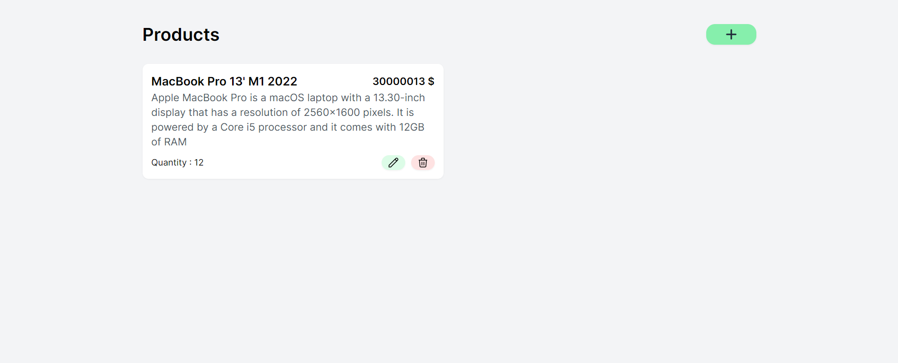
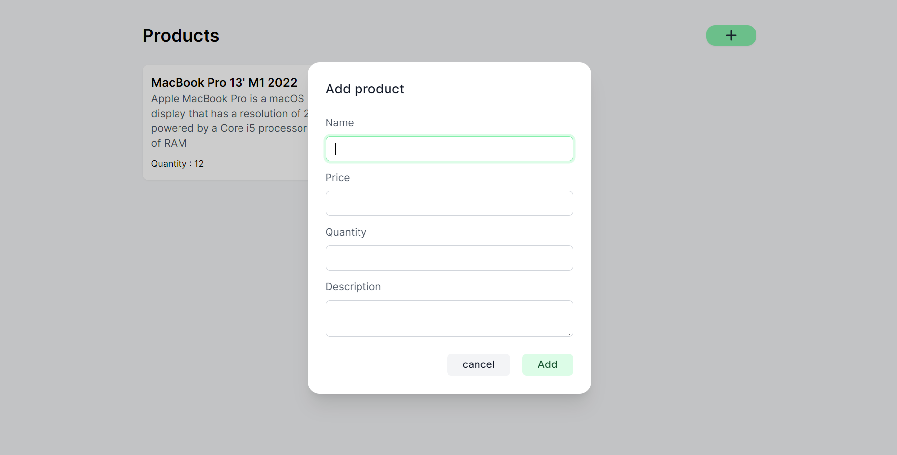
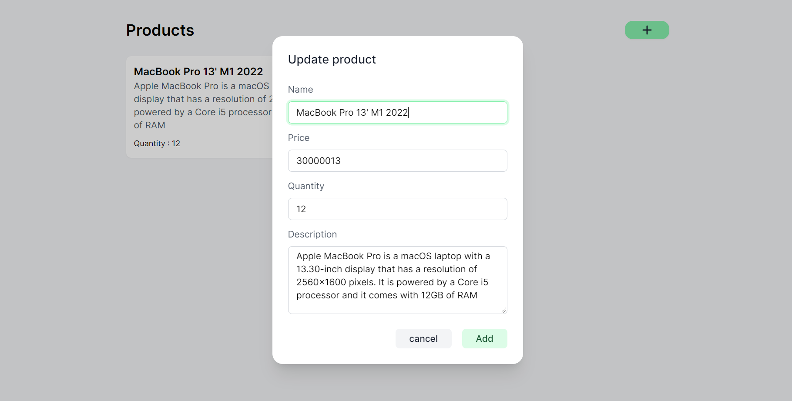
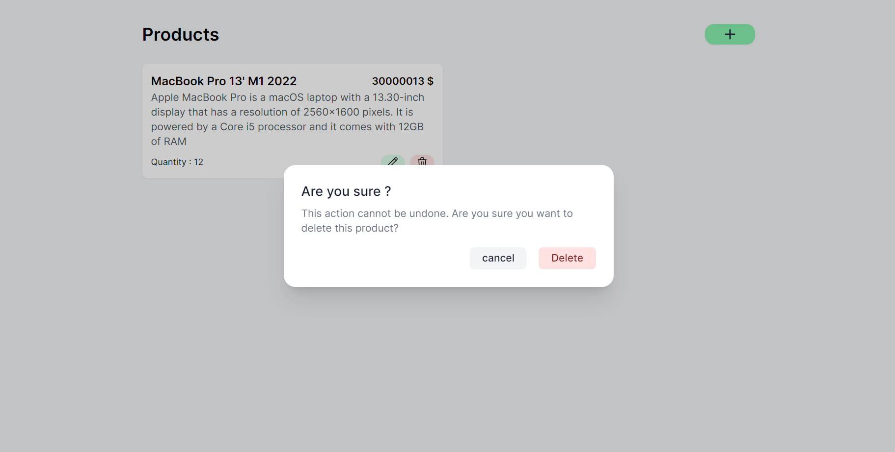

## Mini React CRUD app with Asp.Net Web API 👋

- **Framework UI**: [Reactjs](https://reactjs.org/)
- **CSS framework**: [Tailwindcss](https://tailwindcss.com/)
- **Database**: SQL server
- **API server**: .NET 5

## ✨ Demo

<p align="center">
  
</p>
- Add
<p align="center">
  
</p>
- Update
<p align="center">
  
</p>
- Delete
<p align="center">
  
</p>


## 🚀 Usage

1: Start api server

```sh
cd WebAPI
```
- Update database string

```sh
dotnet run
```

2: Start react app

```sh
cd react-webapp
```
```sh
yarn dev
```
